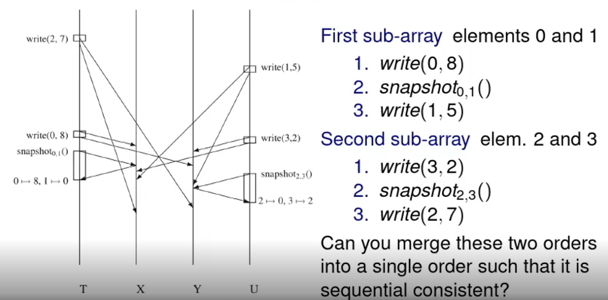
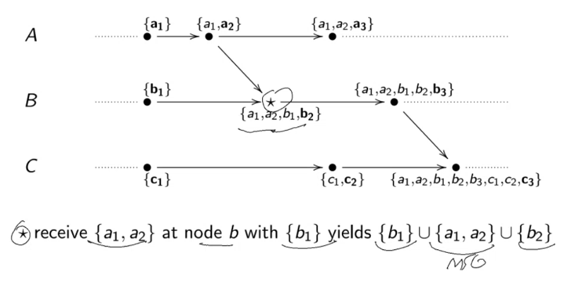
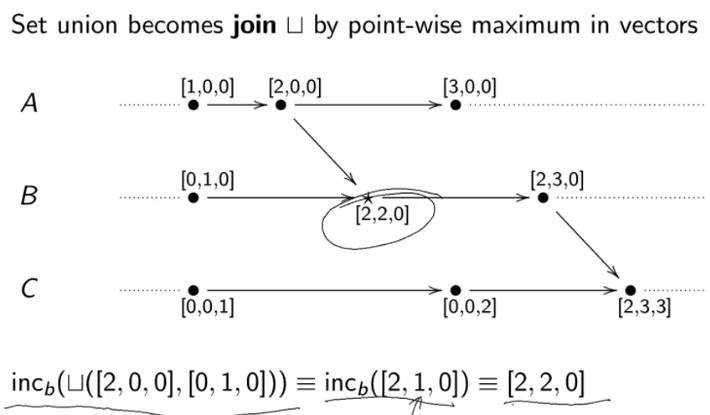
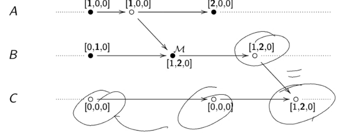
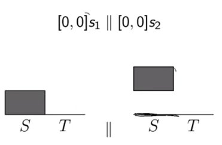
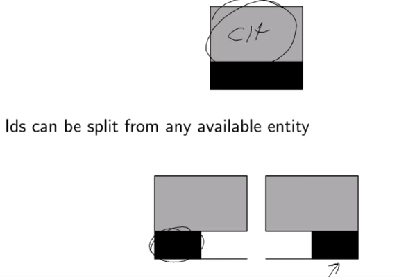
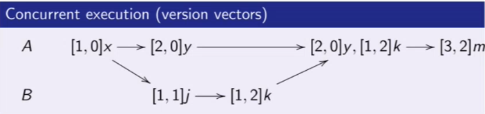
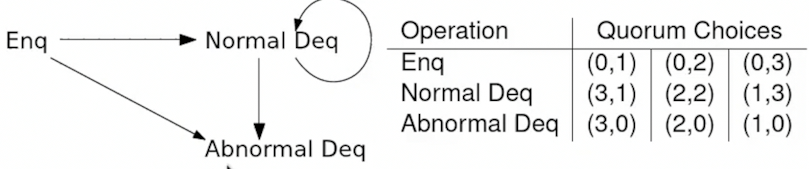
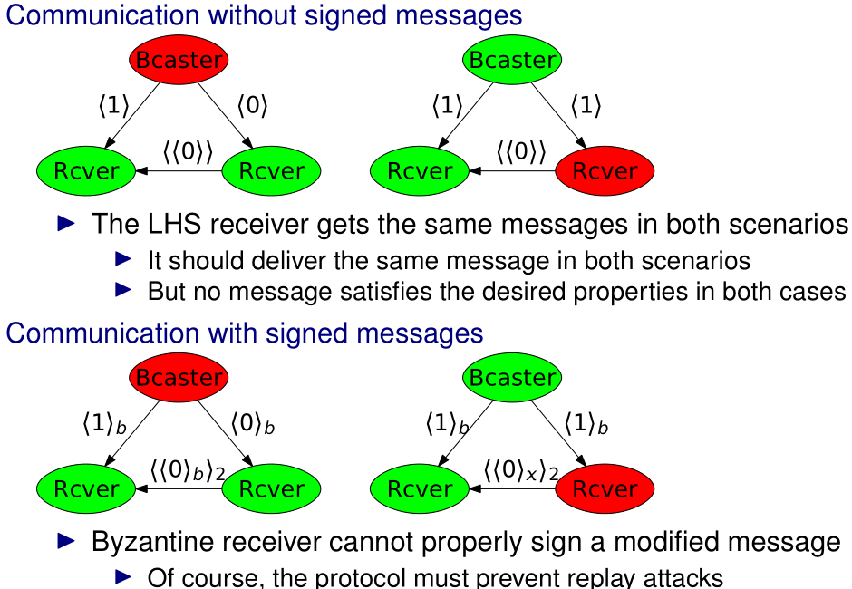

# SDLE resumo do resumo

## Data replication

- Replicate data at many node;
- `+` performance `+` reliability `+` availability `+` scalability;
- **Problem:** push data to all replicas => ensure **data consistency**.

### Strong consistency

- Todas as réplicas executam updates pela mesma ordem;
- O mesmo initial state leva aos mesmos resultados.


### Sequential consistency

Uma execução é **sequential consistent** se e só se for identica a uma execução
sequencial de todas as operações tal que **as operações executadas numa thread
aparecem na ordem em que são executadas na thread**.

Para cada processo a ordem de operações tem de ser preservada. Tem de haver uma
forma de dar **interleave** dos processos para conseguir o resultado esperado
(sem mudar a ordem dentro de cada processo).

- Este é o modelo providaded por um multi-threaded system num uniprocessor;
- **Not composable** - Assume 2 sub-arrays de 2 elementos. We can't interleave
  operations on the two arrays and still remain sequential consistent.



### Linearizability

Uma execução é **linearizable** se for **sequential consistent** e se quando uma
**_op1_ ocorre antes de uma _op2_** de acordo com um **omniscient observer**
então **_op1_ tem de aparecer antes de _op2_**.

- **Assumption:** - operações têm um start e finish time (global clock):
  - Se _op1_ ocorre antes de _op2_ => _op1_ finish time < _op2_ start time;
  - Se _op1_ e _op2_ dão overlap in time, a sua ordem relativa pode ser qualquer
    uma.

### One-copy serializability (transaction-based system)

Execução de um set de transações é **one-copy serializable** se e só se o seu
outcome for similar à execução dessas transações numa única cópia.

- Era o modelo de consistência mais comum:
  - Hoje em dia as base de dados têm a opção de usar weaker consistency models
    (mais performance);
- É essencialmente **sequential consistency** model quando todas as ops
  executadas em todos os processadores são transactions.

## Scalable distributed topologies

### Graphs

- **Simple Graph** - undirected, no loops, no more than onde edge between any
  two vertices;
- **Connected Graph** - there is a path between any two nodes. Strongly
  connected if path existe nas duas direções;
- **Star** - central vertice and many leaf nodes connected to the central one;
- **Tree** - connected graph with no cycles;
- **Planar Graph** - vertices and edges can be drawn in a plane and no two edges
  intersect (E.g. rings and trees);
- **Ring** - anelzinho de nós. **Periphery** e **center** são todos os nós.
- **Connected Component** - maximal connected subgraph of G;
- **Distance** $d(v_i, v_j)$ - length of the shortest path connecting those
  nodes;
- **Eccentricity of $v_i$** - $ecc(v_i) = max(d(v_i, v_j))$
- **Diameter** - $D = max(ecc(v_i))$
- **Radius** - $R = min(ecc_(v_i))$
- **Center** - $ecc(vi) == R$
- **Periphery** - $ecc(v_i) == D$
- **Walk** - repeat edges e vertices;
- **Trail** - repeat vertices;
- **Path** - não repeate nada.

#### Notes

- In networks, cycles allow **multi-path routing**. This can be more robust but
  data handling can become more complex;
- Centro de uma árvore tem tamanho 1 ou 2;
- Ring têm todos o mesmo raio e diâmetro => todos são periphery e center.

### Complex topologies

- **Random geometric** - vertices dropped randomly uniformly into a unit square,
  adding edges to connect any two points within a given euclidean distance;
- **Random Erdos-Rebyi** - $n$ nodes connected randomly with independent
  probability $p$ => **low diameter com support para small paths**
  ($O(log(n))$);
- **Watts-Strogatz model** - nos estabelecem $k$ contactos locais (metrica de
  distância) e alguns de longa distancia (uniformemente at random) => **low
  diameter e high clustering**;
- **Barabasi-Albert model** - Preferential attachment. The more connected a node
  is, the more likely it is to receive new links. **Degree Distribution follows
  a power law**.

### Synchronous SyncBFS algorithm

Processes communicate over directed edges. Unique UIDs are available, but
network diameter and size is unknown.

- A directed spanning tree with root node _i_ is **breadth first** provided that
  each node at distance _d_ from _i_ in the graph appears at depth _d_ in the
  tree => **menos depth possível**;
- Every **strongly connected graph** has a breadth-first directed spanning tree;
- Execuções diferentes podem dar árvores diferentes (ordem de chegada das
  mensagens) mas têm sempre a mesma depth (efeito das rondas).

#### Algorithm

- Começa tudo com `parent = null` e `marked = False` (exceto a root que começa
  com `marked = True`);
- Processos que foram marcados na round anterior mandam uma _search message_;
- Quem **não está marked ainda** ao receber uma _search message_, marca quem
  enviou como pai e fica _marked_ => se já tiver marked discarta novas _search
  messages_.

#### Complexity

- **Time** - at most _diameter_ rounds (depende de $ecc(i_0)$);
- **Message** - $|E|$ - mensagens são enviadas em todas as edges;
- **Child pointers** - se parents precisam de saber quem são os seus filhos,
  estes respondem com _parent_ ou _nonparent_ às _search messages_. Só é easy se
  o graph for undirected (pode-se fazer à mesma em general strongly connected
  graphs);
- **Termination** - Fazer root saber quando a tree está construída - Todos os
  procs respondem com _parent_ ou _nonparent_. Parent termina quando todas as
  children terminam. Responses são coletadas desde as leaves até à root.

#### Applications

- **Aggregation of values** - input values in each process can be aggregated
  towards a sync node (cada valor só contribui 1 vez);
- **Leader election** - largest UID wins. Todos os processos tornam-se root da
  sua própria árvore e agregam Max(UID). Cada um decide comparando o seu UID com
  o Max(UID);
- **Broadcast** - message payload pode ir junto com a SyncBFS construction
  ($|E|$) ou ser broadcasted depois de formar a árvore ($|V|$);
- **Computing diameter** - cada processo constroi uma SyncBFS. Em seguida
  determinam _maxdist_ (longest tree path). Depois, todos os processos usam as
  suas árvores para agregar $Max(maxdist)$ desde todos os roots/nodes - Time
  $O(diam)$ and messages $O(diax * |E|)$.

### Reliable FIFO

- Função `cause()` mapeia um evento para o evento que o gerou;
- `cause(receive(x)) = send(y) => x = y`;
- **cause é surjective** - Mensagens não são perdidas. Cada `send` tem um
  `receive`;
- **cause é injetive** - Mensagens não são duplicadas. Cada `receive` tem um
  `send` distinto;
- Ordem é preservada.

### AsynchSpanningTree

- Mesmo algoritmo que **SyncBFS**, mas usa apenas o delay de envio/chegada de
  mensagens em vez de rondas => eventos;
- Não produz necessáriamente uma **breadth first spanning tree** => **depth pode
  ser maior que a mínima possível**;
- Faster longer paths will win over slower direct path when setting up parent;
- **Invariants:**
  - Tudo se forma a partir de $i_0$ (root) e só há mensagens em nós já
    integrados na árvore;
  - Todos os nós são searched.
- O algoritmo constroi sempre uma spanning tree.

#### Complexity

- Apesar de time limit de msg n existir, vamos assumir upper bounds:
  - tempo para processar um effect => l;
  - tempo para entregar uma mensagem => d.
- **Messages** - $O(|E|)$
- **Time** - $O(diam(l + d))$
- Uma árvore com height, _h_, maior que _diam_ pode occorer apenas se não
  demorar mais tempo que uma árvore com $h = diam$ => **faster long paths must
  be faster**.

#### Applications

- **Child pointers and broadcast** - Se nós reportarem _parent_ ou _nonparent_,
  podemos fazer uma tree that broadcasts. Um fast path não é sempre fast =>
  complexity é $O(h(l + d))$ (at most $O(|V|(l + d))$);
  - Um **caminho longo** só se forma se for mais rápido, mas eventualmente pode
    deixar de ser mais rápido que o caminho curto => temos de **reverificar**
- **Broadcast with Acks** - Coleta **Acks** enquanto a árvore vai send
  construída. Quando recebe um broadcast, nó dá Ack se já conhecer e dá Ack ao
  parent quando todos os neighbors que derem Ack;
- **Leader Election** - Se quando se iniciar termination, todos os nós
  reportared o seu UID, podemos fazer leader election com **unknown diameter** e
  **node count**.

### Epidemic Broadcast Trees

- **Gossip broadcast**:
  - highly scalable and resilient;
  - excessive message overhead.
- **Tree-based broadcast**:
  - small message complexity;
  - fragile in the presence of failures.
- **Gossip strategies**:
  - **eager push** - immediately forward new messages;
  - **pull** - nodes periodically query for new messages;
  - **lazy push** - nodes push new message ids and accept pulls.

#### Gossiping into tree

- Nós escolhem conjunto pequeno (3 ou 4) de nós aleatórios como vizinhos;
- Links são bidirecionais e neighbors estáveis;
- Canais em que chega uma mensagem primeiro => **eager push**;
- Duplicate receptions => origin é **lazy push**;
- Eager push de payload e lazy push de metadata;
- Quando árvore parte, vamos receber metadata sem payload => Timer de controlo
  expira e promove **lazyPush** a **eagerPush**;
- Se ficarem caminhos redundantes => algoritmo limpa.

### Small Worlds

- "Six degrees of separation";
- Erdös-Rényi não é bom para people acquaintaces pk é demasiado random (no
  priority para people close by);
- Watts Strogatz graph => low diameter e high clusting;
- Se dermos flood a um grafo destes, um observador global consegue encontrar
  caminhos $O(log N)$ entre 2 pontos arbitrários;
- **Os caminhos não têm locality** => é dificil encontrar esses caminhos curtos
  só com local knowledge (dar um hop não nos aproxima sempre do destino);
- **Solução: Kleinberg** - em vez de usar uma probabilidade uniforme, dar mais
  prioridade a ligações próximas (exponencial) => **tipo os fingers no Chord**.

## System design for large scale

### Napster

- Catálogo centralizado + downloads entre peers => **Semi-descentralizado**;
- **Double firewall problem** - abilidade de comunicar com server não significa
  conseguirmos aceitar comunicações.

### Gnutella

- Fully distributed P2P;
- Partially randomized overlay network => cada nó conecta-se a k vizinhos (varia
  entre nós);
- **Bootstrapping** - host caches;
- **High churn** - local host caches ficam desatualizadas rapidamente;
- **Routing** - flooding + reverse path routing;
- **Push message** resolve o problema de single firewall mas não double
  firewall.

### DHT

#### Chord

- UID no range [0, $2^m - 1$];
- Cada nó tem _m_ fingers e _r_ vicinity nodes;
- Routing é $O(log(n))$

#### Kademlia

- Distance metric é XOR.
- Routing é simétrico;
- Alternative next hops can be chosen for low latency or parallel routing;
- Routing table tem vários endereços para cada linha (normalmente max 20) => tem
  em conta falhas de nós;
- Uptime do nó é usado para desemptar limited positions;
- Quanto mais deep na tabela, mais difícil encontrar matching nodes;
- Inspecionamos tabela de baixo para cima.

| Bits | Addr    |
| ---- | ------- |
| 0    | 0...    |
| 1    | 11...   |
| 2    | 101...  |
| 3    | 1000... |


## Physical and Logical time

- **Clock drift** - drift entre tempo medido e reference time. E.g. a cada 1
  segundo, o relógio atrasa-se 2 segundos em relação à referência;
- **External sync** - Precision em relação a uma referência authoritative (e.g.
  UTC source);
- **Internal sync** - Precision entre 2 nós;
- Se 2 pessoas estão a **1D de uma source**, podem estar **até 2D entre si**;
- **Monotonicity** - Time can't go backwards. Correcting advanced clocks can be
  obtained by reducing time rate until aimed synchrony is reached.

### Synchronous system

- Sabendo o tempo de trânsito de uma mensagem que contém o tempo, podemos dar
  set a $t' = t + trans$;
- _trans_ pode variar entre _tmin_ e _tmax_. Usar um ou outro dá uma inverteza
  de $u = tmax - tmin$;
- Usando $t + \frac{tmax + tmin}{2}$, a incerteza torna-se $\frac{u}{2}$.

### Asynchronous system - Cristian's algorithm

- **Problema:** tmax pode ser infinito;
- Faz um request, $m_r$, que despoleta uma resposta $m_t$ que contém o tempo
  _t_;
- Medimos o round-trip-time do request-reply => _tr_;
- Assumímos RTT balanceado (igual para cada lado) => $t + \frac{t_r}{2}$;
- Podemos aumentar a precisão repetindo o protocolo até ocorrer um _tr_ baixo;
- **Berkeley algorithm** - Um coordenador mede RTT para vários outros nós e dá
  set ao target time com a average dos tempos. Informamos os nós das correções
  dos tempos usando deltas (e.g. avança 1 sec).

#### Happens-before

- Dá mais info que timeline (tempo é limitado);
- Só indica potencial influência;
- Tem a ver com memória de eventos relevantes;
- Causal histories são encodings simples de causalidade (sistemas abaixo são
  mecanismo de encoding).

### Causal histories

- Memórias são sets de eventos únicos;
- **Causality check** - inclusão num set explica causalidade:
  - `{a1, b1} C {a1, a2, b1}`
  - **Otimização:** testar apenas se o elemento mais recente da esquerda
    pertence.
- Tu estás no meu past se eu conheço a tua history;
- Se eu conheço uma coisa que tu não **e** vice-versa => concurrentes;
- Se eu conheço uma coisa que tu não => sou maior que tu;
- Se as nossas histórias são iguais => somos os mesmos;



- **Compressão:**
  - {a1, a2, b1, b2, b3, c1, c2, c3};
  - {a -> 2, b -> 3, c -> 3};
  - Se tivermos um nº fixo de processos totalmente ordenados => [2, 3, 3]. A
    união de sets torna-se num point-wise max (máximo em cada casa) (não
    esquecer que depois de unir é preciso incrementar evento onde ocorreu).



### Vector clocks


- **Dots** - Em vez de ter [2, 0, 0], temos [1, 0, 0]a2;
  - Assim temos o last event à parte => basta checkar esse para saber se ta num
    history;
  - [1, 0, 0]a2 -> [2, 1, 0]b2 iff a2 (dot) <= 2.
- **Relevant events** - Só eventos que são relevantes são adicionados ao
  histórico;


### Version vectors

- **Version vector** != **Vector clock**;
- Temos evento de merge quando coisas mudam.



### Scaling causality

- Scaling at the edges (**DVVs**) - apenas 1 entrada por proxy (não por
  cliente);
- Dynamic concurrency degree (**ITCs**) - criar/matar active entities;
- **Dynamo like**, get/put interface:
  - **Conditional writes** - rejeitamos escritas em sítios que têm conflito;
  - **Overwrite first value** (last writter wins) - rescrevemos último valor;
  - **Multi-Value** - mantemos escritas concurrentes (vetor de versão).

#### Dotted version vectors (DVV)

- Os eventos ficam ambos no server: `{s1}, {s2}` => histórias diferentes =>
  concurrentes;
- `get()` vai retornar os 2 juntos => user tem depois de dar override na
  escrita.



#### Dynamic causality (ITC)

- Tracking de causality requer acesso exclusivo a identidades;
- IDs podem ser dividos por parte de qualquer identidade (divisão infinita);
- Começamos com ID original que se divide.



- Entities can register new events e tornar-se concurrentes;


- IDs na imagem são todos superiores aos de cima mas concurrentes entre si;
- IDs podem dar join (**mesmo que não sejam partes de um todo originalmente**);


- Podemos juntar os IDs num só;
- **Important** cada replica ativa tem de controlar um espaço de IDs distinto;

## High availability under Eventual Consistency

- **Eventually consistent** - Para sistema ser reliable é preciso trade-offs
  entre consistência e disponibilidade. Caso especial de **weak consistency**.
  Quando há update, se não houver mais updates eventualmente todos os read vão
  ver esse update.
- **CAP** - Entre **consistency**, **availability**, e **tolerance to network
  partitions**, apenas 2 podem ser conseguidos ao mesmo tempo.

### Session guarantees

- **Read Your Writes**;
- **Monotonic Reads** - reads sucessivos refletem um set de writes que não
  decresce;
- **Writes Follow Reads** - escritas são propagadas depois dos reads em que
  dependem. Writes numa sessão podem ser feitos após writes cujo efeito foi
  visto por reads passados na sessão;
- **Monotonic Writes** - escritas só são incorporadas numa cópia do server se a
  cópia já tiver incorporado as escritas anteriores.

### Conflict-Free Replicated Data Types (CRDTs)

- Convergir depois de updates concurrentes => favorece availability e
  partition-tolerance (CAP);
- E.g. counters, sets, mv-registers, maps, graphs;
- **operation-based**:
  - todas as operações são comutativas (inc/dec);
- **state-based**:
  - Estados em conseguimos definir a operação de `join`;
  - `join` é indepotente e associativo;
  - Update têm de respeitar `<=` => reflete monotonia na evolução do estado;
  - **Eventual Consistency, non stop** - `upds(a) C= upds(b) => a <= b`

#### Principle of permutation equivalence

Se as operações numa execução sequencial podem comutar (preservando um
resultado), as mesmas nume execução concurrente podem comutar (preservando **o
mesmo** resultado).


- E.g. para um contador, guardamos pares tipo (Incremento, Decremento);
- Join faz point-wise max nas entries;
- Valor é a `soma de todos os Incs` - `soma de todos os Decs`.

```
B(10, 0) --> {A(35, 0), B(10, 0)} -|
         |                         v
         --> {B(10, 0), C(0, 5)} ----> {A(35, 0), B(12, 0), C(0, 5)}
```

#### Registers

- É um set de write operations;
- **Simple approach:** Last Writer Wins. Usámos timestamps para discartar older
  writes;
  - **Problema:** um peer que tem o relógio atrasado em relação a outro.
- Cada réplica mostra o write mais recente que tem (apply);
- Join escolhe o write com maior timestamp.

#### Multi-value registers



#### Sets

- **Simple approach** (Add-Wins): Temos todos os _e_ que foram `add` e não têm
  `remove` à frente (ordem parcial).
- No exemplo, ficamos com o _x_, porque existe um `add(x)` sem `remove(x)` à
  frente (no ramo do B).


- **Better approach:**
  - Set é um par (payload, tombstones);
  - `apply(add)` - cria tag de add;
  - `apply(rmv)` - cria uma tag nas tombstones por cada add do elemento;
  - `eval` - todos os adds que nao estão nas tombstones;
  - `merge` - par (união de payloads, união de tombstones);
- Concurrent executions can have **richer outcomes**:
  - Com as operações abaixo, acabamos com {x, y};
  - Não é possível fazer uma execução sequencial que resulte nisso: fica sempre
    um `rmv` em último.


## Quorum Consensus

- Todas as réplicas são iguais entre si;
- Cada op (read/write) requer um **quorum**;

### Read/Write quorums must overlap

- Replicas só fazem **read** e **write** => aplicadas a objetos num todo;
- **Read depends on write** => **read** quorum tem de **overlap ao write**
  quorum:
  - $N_R + N_W > N$

### Implementation

- Cada obj. tem um **version number**;
- **Read:**
  - Poll de read quorum para encontrar current **version number**;
  - Servers respondem com a sua versão atual (escolhemos o(s) maior(es));
  - Ler o objeto de um réplica atualizada.
- **Write:**
  - Poll a write quorum para descobrir versão atual;
  - Escreve novo valor com nova versão num write quorum (alteramos todo o obj).
- **Write depende de write prévio** (através de versões) => Write quorums têm de
  dar overlap $N_W + N_W > N$ => **previne incoerência**.

### Ensuring consistency with transactions

- Cliente age como coordenador e as réplicas no quorum agem como participantes;
- **Deadlocks** são possíveis;
- Se o coordenador falhar num tempo mau há blocking desnecessário;
- Pode ser útil user **coordinator proxy servers** em vez dos clientes
  coordenarem;
- Transações trazem availability problems.

#### Naive implementation with faults

- Se houver partição na rede durante write, réplica que foi atualizada pode ser
  isolada da rede;
- Version bump não chega ao quorum todo;
- Alguém faz write num novo quorum de escrita (mesmo dando overlap com o
  antigo);
- Partição de rede resolve-se => 2 objs diferentes em réplicas **com a mesma
  versão**;
- **Solução:** transações (e.g. **two phase commit**):
  - Na partição só a réplica que ficou de fore respondia com commit;
  - As que não viram update => não respondem ou respondem com abort;
  - Client cancela a transação (o outro client dá commit na boa).

#### Naive implementation with concurrent writes

- Fomos buscar a versão ao mesmo tempo (2 clientes) => temos as mesmas versões;
- Ao dar bump, ficamos com a mesma version;
- Os writes vão possivelmente dar 2 objetos diferentes em réplicas diferentes;
- **Solução:** transações (e.g. **two phase commit**):
  - Quem chega primeiro fica com o lock para a sua transação => outra transação
    tem de esperar;
  - Após o primeiro two-phase commit (assumindo sucesso), o segundo pode
    prosseguir;
  - Ao escrever conflicting info => réplica aborta.

### Playing with Quorums

- Manipulando $N_R$ e $N_W$, podemos brincar com os trade-offs de performance e
  availability;
- Baixar 1 sobe o outro (e vice-versa) => não dá para melhorar os 2 ao mesmo
  tempo;
- **Read-one/write-all protocol** - Tudo no write quorum com 1 no read (alone).
  Leitura fast e acessível mas write pesado (basta 1 falhar para n conseguirmos
  dar write).

### Fault tolerance

- Tolera unavailability de réplicas:
  - Incluindo aquela causada pelo processo ou pelo meio de comunicação
    (incluindo partições);
  - Quorum não distingue entre os 2 tipos de falhas.
- No mínimo só precisámos de **metade + 1** ($N/2 + 1$) das réplicas a
  funcionar, sendo que uma delas tem de fazer parte do quorum de escrita
  anterior.

## Dynamo quorums

- Não usa transactions. Usa **version vector** em vez de número de versão;
- **Preference list** - Cada key está associada a um set de servers. Os
  primeiros N são as main réplicas e os outros são backup réplicas;
- Cada operação tem um coordenador => uma das main réplicas da lista (desempenha
  as funções do cliente no quorum).
- **Put:**
  - Gera novo número de versão e escreve valor localmente;
  - Envia `(key, value)` e seu version vector para as main replicas (da pref
    list) => success se pelo menos $W - 1$ replicas responderem.
- **Get:**
  - Coordenador pede todas as versões do par `(key, value)` e seus version
    vectors das main replicas;
  - Após $R - 1$ respostas, retorna todas aquelas que tenham o version vector
    maximal;
  - Se houverem múltiplas verses, a aplicação que faz **get** é responsável por
    fazer **put**.
- Se no falhas => **strong consistency**;
- **Sloppy quorum** (em caso de falhas):
  - Usam backup servers que têm metadata que identifica quem é suposto ter a
    cópia certa (**votos para quem tem a info boa**);
  - Em writes, ficam a segurar dados para depois entregar a mains quando
    voltarem;
  - **Problema:** **não assegura consistency** pk o **write quorum** pode
    **não** dar **overlap** com o anterior.

## Quorum-Consensus Replicated (Abstract Data Types) ADT

- Quando executamos uma op, temos um quorum (set de réplicas) que inclui:
  - Read from **initial quorum**;
  - Write to **final quorum**.
- Quorum de uma op é um par (m, n), onde _m_ é o tamanho do inicial e _n_ do
  final quorum;
- Read op tem um final quorum vazio.

### Constraints

```plaintext
 ->write -----------> read
|   |
 ---
```

- Quorum final de escrita tem intersetar quorum inicial de leitura => **leitura
  vê sempre o mais recente**;
- Quorum final de write tem de intersetar quorum inicial de write => **versions
  são updated corretamente**;
- E.g. minimal (size) quorum para 5 réplicas:

| Operation | quorum choices | ...    | ...    |
| --------- | -------------- | ------ | ------ |
| read      | (1, 0)         | (2, 0) | (3, 0) |
| write     | (1, 5)         | (2, 4) | (3, 3) |

### Replicated queue

- **Enq** - add item to queue;
- **Deq** - remove elem mais recente da queue (exception se empty):
  1. Ler um initial quorum de read para obter versão da queue;
  2. Ler state numa updated replica;
  3. Se a final não tiver vazia => **normal deq**:
  - Remover item da head da queue;
  - Write novo queue state para o quorum final de escrita;
  - Retornar item removido.

| Operation    | quorum choices | ...    | ...    |
| ------------ | -------------- | ------ | ------ |
| Enq          | (1, 5)         | (2, 4) | (3, 3) |
| Normal Deq   | (1, 5)         | (2, 4) | (3, 3) |
| Abnormal Deq | (1, 0)         | (2, 0) | (3, 0) |

Só faz sentido a última pk as outras benificiam o abnormal Deq.

## Herlihy's replication method

- Usa **timestamps** em vez de **version number**;
- Em vez de manter versões do estado, **manter logs**;
- **Assumption:** clientes conseguem gerar timestamps que podem ser totally
  ordered:
  - Ordem consistente com **linearizability**;
  - **Hierarchical timestamp** - 1 field para ordenar transactions e outro para
    ordenar dentro de uma transactions.
- **Read** - similar ao version-based mas comparamos timestamps instead;
- **Write:**
  - Não há necessidade de ler versão de um initial quorum => não é necessária a
    initial message round;
  - Cliente só precisa de escrever o novo estado para o final quorum (suitable
    only for whole state changes).

```plaintext
write -----------> read
```

| Operation | quorum choices | ...    | ...    | ...    | ...    |
| --------- | -------------- | ------ | ------ | ------ | ------ |
| read      | (1, 0)         | (2, 0) | (3, 0) | (4, 0) | (5, 0) |
| write     | (0, 5)         | (0, 4) | (0, 3) | (0, 2) | (0, 1) |

### Implementation de uma replicated queue

- **Event** - mudança de estado é um par `(Operation, Outcome)`:
  - **Operation** - `Read()` ou `Write(x)`;
  - **outcome** - `Ok()` or `Ok(x)`.
- **Log** - timestamped events;
- **Deq:**
  - Pede logs a um initial quorum e cria um **view**:
    - **View** é o merge dos logs por ordem das timestamps;
    - Discarta dups (same log).
  - Reconstroi queue a partir da view e encontra item para retornar;
  - Se a queue não estava vazia:
    - Regista event => append à view;
    - Envia a view modificada para um final quorum.
- **Enq** - cliente só envia a operação (no **view**).



#### Optimizations

- Logs podem crescer indefinidamente;
- **Garbage collection:**
  - Se um item foi deq, todos os items com earlier timestamp tmb tiveram de ser;
  - Não podemos simplemente limpar => re-read com log merge;
  - **Horizon timestamp** - timestamp do deq mais recente;
  - Log vem só com timestamps maiores que **horizon timestamp**.
- **Cache logs at clients**.

#### Issues

- Damos rely em timestamps gerados pelo client:
  - Hierarchical timestamps podem resolver;
  - Precisam de transações.
- Logs têm de ser garbage collected => dependem da ADT implementada (apesar de
  queue ser fácil, outras ADT podem ser dificeis).

## Consensus with Byzantine failures



### Size-based Byzantine Masking Quorums


- **M-consistency** - ensures that a client always obtains an up-to-date-value
  => need to find it;
- Every pair of quorums must intersect in at least $2 * f + 1$ servers:
  - let f be the bound on faulty servers;
  - We need at least $f + 1$ up-to-date non-faulty servers => outnumber the
    faulty ones;


- **M-availability** - required for liveness;
- $n - f >= q$
  - f upper bound byzonte;
  - q size of a quorum;
  - n number of servers;

Combining the inequalities => $q = 3 * f + 1$

### Non-byzantine Read-Write Quorums based on size

- $w >= f + 1$ - ensures writes survive failures;
- $w + r > n$ - ensures that reads see most recent write;
- $n - f >= r$ - ensures read availability;
- $n - f >= w$ - ensures write availability.
- => $n > 2 * f$
  - Let $n = 2 * f + 1$;
  - All conditions are valid;
  - Apparently increasing _n_ only worsens performance, but increases fault
    tolerance (f can rise).

#### Read operation

- Query servers até ter reply de $3 * f + 1$ different servers;
  - _A_ é o set de value/timestamp pairs recebidos de pelo menos $f + 1$
    servers;
  - O _A_ é os pares que pelo menos $f + 1$ servers reportaram;
  - _A_ pode ser vazio se houver replicas que ainda n atualizaram valor.
- Fazer `Result(A)` => retorna o valor com maior timestamp (ou vazio se A for
  vazio).

#### Naive Implementation under faults/concurrent writes

- Alguem tem de chegar à maioria primeiro => ganha;
- Se ninguem chegar a maioria, valor é considerada faulty nos reads e o Result
  não dá nada => escreve-se por cima depois.

#### Server failures and liveness

- Com _M - Availability_, há sempre um quorum, mesmo que todos os _f_ byzantinos
  falhem;
- Write protocol tem uma **never give up** policy. Isto garante a entrega de
  todas as mensagens enviadas quando o sistema se torne synchronous ou os
  problemas de comunicação sejam fixed.

## State machine replication

### Impossibility of consensus with faulty process

- **Consensus problem** - cada processo começa com um input value de um set _V_
  e têm de decidir num valor de _V_;
- **Safety:**
  - **Agreement** - todos os proc tomam a mesma decisão;
  - **Validity** - o valor está no set de valores possíveis.
- **Liveness** - todas as execuções do protocolo decidem num valor;
- **FLP's impossibility result:** num sistema asynch em que pelo menos 1 proc
  possa falhar, não há nenhum algoritmo determinista de consensus que seja
  **live** e **safe** (mesmo que a rede seja fiável).
  - Não dá para distinguir crash de slow;
  - Se proc não decide => ficamos stuck => viola liveness;
  - Se proc decide independentemente da decision rule => possivelmente viola
    safety.

### Algoritmo (SMR)

- **View** - configuração de sistema numerada:
  - replicas passam por uma sucessão de **views**;
  - cada **view** tem um **leader**: $p = v mod n$
  - v - view number; $n = 3 * f + 1$ - numero de replicas;
  - A **view** muda quando o leader atual é suspeito.
- Client envia um pedido para executar uma operação ao **leader**;
- Leader **atomically bradcasts** the request para todas as replicas => garante
  um ordem total na entreda de mensagens de non-faulty replicas;
- Replicas executam o pedido e enviam a resposta ao client;

### Client

- O pedido do client (enviado ao leader) tem uma timestamp, t => garante
  **exactly once** semantics;
  - Monotonically increasing;
  - Todas as mensagens das replicas para o cliente incluém o current view
    number, v => client track o leader atual;
- O cliente espera por $f + 1$ replies com **assinaturas válidas** (com o mesmo
  t e resultado);
- Se o cliente não obtiver respostas suficientes num intervalo de tempo:
  - Broadcast para todas as replicas;
  - Se pedido já foi processado, enviam resposta again;
  - Se não, replicas enviam o pedido para o **leader** => se este não fizer o
    multicast do pedido para o grupo => considerado faulty pelas réplicas.

## PBFT - Quorums and Certificates

- PBFT uses quorums to implement atomic multicast;
- **Intersection** - any two quorums have at least a correct replica in common
  (they intersect in $f + 1$ replicas);
- **Availability** - there is always a quorum with no faulty replicas;
- Messages are sent to replicas;
- Replicas collect **quorum certificates**:
  - **Quorum certificate** - é um set com 1 mensagem por cada elem num quorum =>
    assegura que a informação relevante foi guardada;
  - **Weak certificate** - set com pelo menos $f + 1$ mensagens de diferentes
    replicas => o set que um cliente tem de receber antes de returnar um
    resultado é um **weak certificate** (**Reply certificate**).

### Replicas

- Estado de uma replica: estado do serviço + message log + view id.
- Quando leader, _l_, recebe um client request, _m_ => começa three-phase
  protocol de multicast atómico (para todas as réplicas):
  - **Pre-prepare**;
  - **Prepare** - garante total order dos requests numa view em conjunto com o
    **pre-prepare**;
  - **Commit** - garante total order de requests entre views.

### Pre-Prepare Phase

- Leader:
  - Dá um sequence number, _n_, ao request (monotonically increasing);
  - Multicast da mensagem de PRE-PREPARE para as outras replicas. Leva um digest
    da mensagem, _n_, e _v_.
- Replica aceita a PRE-PREPARE se:
  - Estiver na view _v_;
  - As assinaturas no request m e na PRE-PREPARE message forem válidos;
  - Ainda não tiver aceite uma PRE-PREPARE para _v_ com _n_ e digest diferente;
  - _n_ tem de estar entre low e high watermark => previne faulty leader de
    esgotar o sequence number space selecionando um muito grande.

### Prepare Phase

- Ao receber PRE-PREPARE message, a replica entra em **prepare phase**:
  - Multicast para as outras replicas de PREPARE.
- Ao receber PREPARE, a replica/leader aceita se:
  - A view for a mesma que a sua atual;
  - A assinatura estiver correta;
  - O sequence number tiver dentro das water marks.
- **Prepared Certificate** - cada replica coleta para o request _m_, em _v_, com
  _n_:
  - 1 PRE-PREPARE;
  - $2 * f$ PREPARES de outras replicas;
- Após certificado obtido, a replica sabe a ordem do request na view atual.

**Total order within a view** - com estas 2 phases, uma replica não pode obter
um certificado de requests diferentes com a mesma view e sequence number.

### Commit Phase

2 phases anteriores **não garantem ordem entre view changes**.

- Apos obter um prepared certificate:
  - Replica entrea commit phase;
  - Multicast de COMMIT para todas as replicas.
- Aceita COMMIT com os mesmos critérios que PREPARE;
  - Replica pode receber COMMIT antes de estar na commit-phase.
- **Commit certificate** - $2 * f + 1$ COMMIT messages (same _v_, _n_, _d_) de
  diferentes replicas;
- **Committed request** - se replica tiver **prepared e committed
  certificates**.

Guarante que se uma réplica se comprometer com um pedido, o pedido foi preparado
com pelo menos $f + 1$ non-faulty replicas.

### Request delivery and execution

- Executa pedidos committed quando executar todos aqueles com _n_ inferior =>
  non-faulty replicas execute requests in the same order.
- Replicas reply to the client after executing the requested operation:
  - Discard requests com timestamp menor que a última timestamp que enviaram ao
    client => **exactly-once semantics**.

### Garbage collection + Checkpoints

- Não podemos apagar logs de pedidos já committed pk podemos usar em view
  changes (Replica repair/replace => need state sync);
- Replica periodicamente cria **checkpoint** do seu estado (prova de correção);
  - Depois de provado => **stable checkpoint**.
  - Prova requer troca de mensagens;
- Replica pode manter vários checkpoints não estáveis, mas 1 só estável (mais
  recente).

#### Checkpoint Proof Generation

- Replica faz multicast de CHECKPOINT message. Contém:
  - n - sequence number do last request executado no estado;
  - d - digest do state.
- CHECKPOINT messages recebidas são guardadas até **stable certificate** ser
  obtido;
- **stable certificate** - weak certificate de CHECKPOINT messages assinadas por
  diferentes replicas (**incluindo a si mesma**);
- Quando é coletado **stable certificate** a replica discarta:
  - PRE-PREPARE, PREPARE, COMMIT messages com _n_ menos;
  - Checkpoints mais antigos (e respetivas CHECKPOINT messages).
- Low e High watermarks são avançadas quando se começar um novo checkpoint.

## Blockchain - BitCoin

- Cadeia de blocos => set de eventos (também pode guardar estado);
- Cada bloco contém um **header** com metadata;
  - Inclui referência para o bloco anterior na chain;
- Primeiro bloco na chain é o **genesis block**;
- Blocos são appended à **blockchain head** (most recently added block);
- O tamanho máximo de um bloco é 1MByte.

### Network

- P2P em que cada nó se liga 8 nós;
- Usa um mecanismo de boostrapping;
- Não existe limite de nós então um nó (caso aceite conecções) pode ligar-se a
  muitos mais nós;
- Peers mantém uma cópia da blockchain inteira.

### Consensus

- É preciso concordar no conteúdo de blocos e sua ordem;
- Algorimos tradicionais que suportam falhas bizantines dão rely em quorums:
  - É dificil saber quantos nós existem na rede;
  - É facil criar múltiplas identidades (Sybil attack).
- **Solution:** **proof-of-work**.

#### Proof-of-Work (PoW)

- Resolver um puzzle cryptographico que leva um tempo aleatório (mas grande) a
  resolver;
  - Encontrar um **nonce** para por no header de um bloco de forma a que o seu
    SHA-256 seja menor que um **target** conhecido a priori.
- SHA-256 é non-invertible => temos de fazer brute force.
- O **target** é ajustado de modo a que seja gerado 1 bloco a cada 10 minutos:
  - Block rate é independente do hash-power da network;
  - São espectados $2^{256}/target$ hashes para resolver o puzzle;
  - Bitcoin ajusta o **target** a cada 2016 blocos (expectado equivaler a 14
    dias).

#### Block Broadcasting

- Após resolver PoW, nó dá broadcast do novo bloco;
- Após receber um bloco, um nó:
  - Verifica se é válido: verifica PoW e transactions;
  - Se bloco é valido, nó para de procurar PoW e adiciona o novo bloco à cabeça
    da blockchain;
  - Propaga novo bloco.
- Em ambos os casos, o nó começa a trabalhar no próximo PoW;
- Quando um nó recebe um bloco, podem faltar antecessores à chain:
  - Nó procura missing blocks.

#### Anti-Entropy

- Após validar novo bloco, nó envia aos seus vizinhos mensagens contendo um set
  de hashes de blocos que ele tem => inv message;
- Se nó recebe mensagem com hash de blocos que ele não tem, pede os blocos a
  quem enviou a mensagem => getdata message;
- Quando nó recebe `getdata`, envia os blocos pedidos => block message;
- Quando bloco é gerado, é inserido na rede usando um `block` message não
  solicitada.

#### Block propagation delay

- Validação de um bloco adiciona delay;
- Validação é repetida em cada hop;
- Block propagation delay has a **long tail distribution**.

#### Forks

- É possível que mais do que 1 peer possa resolver um PoW;
- O propagation delay grande o que pode contribuir para isto;
- Este evento chama-se **fork**;
- Se hourve conflitos, a blockchain mais comprida (com mais PoW) é que ganha;
  - Troca para a nova quando souber da sua existencia.
- Não há 100% garantia que um bloco vá persistir na chain:
  - Chance de ser removido diminui com cada bloco adicionado em cima;
  - 6 confirmations são consideradas final (chance);
  - **code-based checkpointing** - a hash de um bloco que não pode ser replaced
    (nem os que o precedem) foi hardcoded.
- **Eventual consistency** with high probability:
  - Assumindo que o hash power do adversario é limitado;
  - Se for maior que 50%, ele eventualmente pode mudar tudo.
- Selfish mining strategies podem não anunciar logo o seu PoW e começar a
  trabalhar numnovo até alguém anunciar o seu => começar a minar o seguinte mais
  cedo então têm maior chance de o substituir.

### Scalability

- Blockchain cresce 60GB por ano;
- Fazemos broadcast em rede muito grande;
- Só temos 1MB por cada 10 minutos;
- Só podemos fazer pouca transactions por segundo;
