# SDLE 2021/2022

- **Distributed System** - collection of distinct processes which are spatially
  separated and which communicate with one another by exchanging messages;
- **Message** - an atomic bit string.

## Message-based communication

### TCP Reliability

- Network can be abstracted as a communication channel;

| Property                          | UDP     | TCP    |
| --------------------------------- | ------- | ------ |
| Abstraction                       | Message | Stream |
| Connection-based                  | N       | Y      |
| Reliadbility (loss & duplication) | N       | Y      |
| Order                             | N       | Y      |
| Flow control                      | N       | Y      |
| Number of recipients              | `1..n`  | 1      |

- **TCP guarantee** - the application will be notified if the local end is
  unable to communicate with the remote end;
- **TCP cannot guarantee that there won't be data loss**;
- **TCP** does not re-transmit data that was lost in other connections.

### Message duplication

- Can't always retransmit a message that may have not been delivered => the
  message might have arrived;
- **TCP** is not able to filter data duplicated by the application (only
  duplicated TCP segments);
- This may be an issue: duplicated data is a request for a **non-idempotent**
  operation;
- Re-sync might be necessary.

### RPC

- RPC is typically implemented on top of the transport layer (TCP/IP);

#### Client Stub

- **Request:**
  1. Assembles message: parameter marshalling;
  2. Sends message (`write()`/`sendto()`);
  3. Blocks waiting for response (`read()`/`recvfrom()`) (differente in async
     RPC).
- **Response:**
  1. Receives reponses;
  2. Extracts the results (unmarshalling);
  3. Returns to client (assuming synchronous RPC).

#### Server Stub

- **Request:**
  1. Receives message with request (`read()`/`Recfrom()`);
  2. Parses message to determine arguments (unmarshalling);
  3. Calls function.
- **Response:**
  1. Assembles message with the return value of the function;
  2. Sends message (`write()`/`sendto()`);
  3. Blocks waiting for a new request.

#### Async. vs Sync.

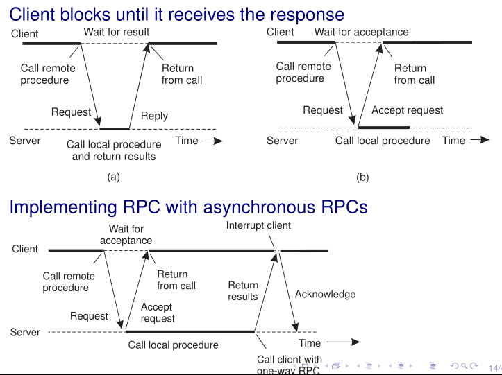

---

- (non-async) RPC is a useful paradigm - programming almost as simple as
  non-distributed application (discarding failures);
- Only great for request-reply communication;

### Asynchronous Communication

- **Problem:** Communicating parties may not always be simultaneously available;
- **Solution:** Async communication (parties don't need to be active
  simultaneously).

## Message Oriented Middleware (MOM)

- Approprieta when sender and receiver are loosely coupled: Email/SMS;
- Async message-based communication:
  - Sender and receiver need not synchronize with one another to exchange
    messages;
  - Middleware stores the messages as long as needed to deliver them;
  - At the lowest communication level, there is sync between client and
    middleware.
- **publishers** - send messages;
- **subscribers** - receive messages.

### Basic Patters

- **Point-to-Point** (**queue**):
  - Several senders can put messages in a queue;
  - Several receivers can get messages from a queue;
  - Each message is **delivered to at most one receiver**;
- **Publish-subscriber** (topics):
  - Several **publishers** can put messages in a topic;
  - Several **subscribers** can get messages from a topic;
  - Each message can be **delivered to more than one subcriber**;

### Differences with UDP

- **UDP** supports Unicast and Multicast communication;
- **MOM**:
  - **Asynchrony** - senders/publishers need not synchronize with
    receivers/publishers;
  - **Anonymity** - senders/publishers need not know receivers/subscribers (and
    vice-versa). Queues and topics generaly use high-level naming (not transport
    level addresses).

### JMS Queues

| --        | Blocking | Non-Blocking | Asynchronous |
| --------- | -------- | ------------ | ------------ |
| send()    | Y        | --           | via callback |
| receive() | Y        | via timeout  | via callback |

## Threads

- Threads in a process share most resources, except the stack and the processor
  state;
- Thread-specific info: state (ready, running, waiting), process state (SP, PC),
  and stack;
- **Kernel-level**:
  - kernel's scheduler allocates cores to threads;
  - OS keeps threads table with information on every thread;
  - Management operation incur a system call.
- **User-level**:
  - kernel is not aware of the existence of threads;
  - OS doesn't need to support it;
  - Problems like thread page-fault (all have to wait), non-blocking system
    calls, thread never yielding;
  - Cannot be used to exploit parallelism in multicore architectures.

## Multi-threaded server

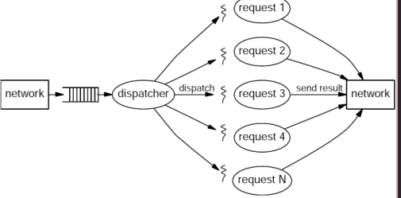

- Common pattern:
  - 1 dispatcher thread which accepts connection requests;
  - Several worker threads, each processing a single request.

### Bounding threads resource usage

- **Thread-pools**:
  - allow to bound the number of threads;
  - avoid thread creation/destruction overhead (sys call).
- **Excessive thread-switch overhead**:
  - arises more often when using multiple-thread pools;
  - bound number of active thread (e.g. using semaphore).

## Sync vs. Async I/O

### Sync I/O

- **Blocking**:
  - thread blocks until the operation is completed;
  - `write()`/`send()` sys calls may return immediately after copying the data
    to kernel space and enqueueuing the output request;
- **Non-blocking**:
  - thread does not block (not even in input operations => call returns
    immediately with whatever data is available at the kernel);
  - in Unix, all I/O to block devices (and regular files or directories) is
    blocking.

### Async I/O

- Sys call enqueues the I/O request and return immediately;
- Thread may execute while the requested I/O operation is being executed;
- Thread learns about the termination of the I/O operation either by polling or
  via event notification (signal or function call);

### poll()/epoll() and Blocking I/O

- use fewer threads than data sockets in TCP server by polling for events;
- `poll()` blocks until one of the requested events (e.g. data input) occurs;
- Can set timeout aswell;
- **Problem:** doesn't work with regular file (poll always true for read and
  write) => use helper threads for disk I/O.

## Event-driven Server


- Server executes a loop:
  - wait for events (usually IO);
  - process the events.
- Blocking is avoided by using non-blocking IO;
- Scalability issues:
  - Data copying => user buffer descriptors or scatter/gather IO;
  - Memory alloc (default allocator is general purpose) => design own;
  - Concurrency control => avoid sharing + locking granularity + minimize
    critical sections.

## Data Replication

- Replicate data at many nodes;
- Performance => user has more local reads;
- Reliability => no data-loss unless data is lost in all replicas;
- Availability => data available unless all replicas fail or become unreachable;
- Scalability => balance load across nodes for reads;
- **Update** => push data to all replicas => Problem of ensuring **data
  consistency**.

### Strong consistency

- All replicas execute updates in the same order. Same initial state leads to
  same result.

#### Sequential Consistency

An execution is **sequential consistent** iff it is identical to a sequential
execution of all the operations in that execution such that all operation
executed by any thread appear in the order in which they were executed by the
corresponding thread.

**A ordem em que as operações são ordenadas (no global), têm de ser consistentes
com a ordem em que cada cliente vê operações.**

- This is the model provided by a multi-threaded system on a uniprocessor;
- Protocol:
  - Read(a) - reads value at index a from one replica;
  - Write(a, v) - writes value v to index a to all replicas;
  - Snapshot - reads all from one replica.
- **Not Composable** - Assume 2 sub-arrays of 2 elements. We can't interleave
  operations on the two arrys and still remains sequential consistent.


#### Linearizability

Execution is **linearizable** if it is **sequential consistent** and if _op1_
occurs before _op2_ according to an **omniscient observer**, then _op1_ appears
before _op2_.

- **Assumption:** operation have start and finish time (measured on some global
  clock):
  - if _op1_ occurs before _op2_, _op1_ finish time is smaller than _op2_ start
    time;
  - if _op1_ and _op2_ overlap in time, their relative order may be any.
- **Protocol:** Igual mas o **Write** tem de esperar por um **ACK**.

#### One-copy Serializability (Transaction-based systems)

Executions of a set of transactions is **one-copy serializable** iff its outcome
is similar to the execution of those transactions in a single copy.

- Serializability used to be the most common consistency model used in
  transaction-based systems:
  - nowadays there are weaker consistency models to acieve higher performance.
- This is essentially the **sequential consistency** model when the operations
  executed by all processors are transactions;

## Scalable Distributed Topologies

- **Simple Graph** - undirected, no loops, no more than onde edge between any
  two vertices;
- **Connected Graph** - there is a path between any two nodes. Strongly
  connected if path existe nas duas direções;
- **Star** - central vertice and many leaf nodes connected to the central one;
- **Tree** - connected graph with no cycles;
- **Planar Graph** - vertices and edges can be drawn in a plane and no two edges
  intersect (E.g. rings and trees);
- **Ring** - anelzinho de nós. **Periphery** e **center** são todos os nós.
- **Connected Component** - maximal connected subgraph of G;
- **Distance** $d(v_i, v_j)$ - length of the shortest path connecting those
  nodes;
- **Eccentricity of $v_i$** - $ecc(v_i) = max(d(v_i, v_j))$
- **Diameter** - $D = max(ecc(v_i))$
- **Radius** - $R = min(ecc_(v_i))$
- **Center** - $ecc(v_i) == R$
- **Periphery** - $ecc(v_i) == D$
- In networks cycles allow **multi-path routing**. This can be more robust but
  data handling can become more complex;

### Complex topologies

- **Random geometric** - vertices dropped randomly uniformly into a unit square,
  adding edges to connect any two points within a given euclidean distance;
- **Random Erdos-Rebyi** - n nodes connected randomly with independent
  probability p => low diameter com support para small paths ($O(log n)$);
- **Watts-Strogatz model** - nos estabelecem k contactos locais (metrica de
  distancia) e alguns de longa distancia (uniformemente at random) => low
  diameter e high clustering;
- **Barabasi-Albert model** - Preferential attachment. The more connected a node
  is, the more likely it is to receive new links. Degree Distribution follows a
  power law.

### Synchronous SyncBFS Algorithm

Processes communicate over directed edges. Unique UIDs are available, but
network diameter and size is unknown.

- A directed spanning tree with root node _i_ is **breadth first** provided that
  each node at distance _d_ from _i_ in the graph appears at depth _d_ in the
  tree;
- Every **strongly connected graph** has a breadth-first directed spanning tree;
- **Applications:**
  - Aggregation of values - input values in each process can be aggregated
    towards a sync node (cada valor só contribui 1 vez);
  - Leader election - largest UID wins. Todos os processos tornam-se root da sua
    própria árvore e agregam Max(UID). Cada um decide comparam o seu UID com o
    Max(UID);
  - Broadcast - message payload pode ir junto com a SyncBFS construction ou ser
    broadcasted depois de formar a árvore;
  - Computing diameter - cada processo constroi uma SyncBFS. Em seguida
    determinan _maxdist_ (longest tree path). Depois, todos os processos usam as
    suas árvores para agregar $Max(maxdist)$ desde todos os roots/nodes - Time
    $O(diam)$ and messages $O(diax * |E|)$.

#### Initial state

- parent = null
- marked = False (True in root node $i_0$)

#### Algorithm

- Process $i_0$ sends a search message in round 1;
- Unmarked processes receiving a search message from `x` set `marked = True` and
  `parent = x`. In the next round search messages are sent from these processes.

#### Complexity

- Time - at most _diameter_ rounds (depending on $i_0$ eccentricity);
- Message - $|E|$. Messages are sent across all edges $E$;
- Child pointers - if parents need to know their offspring, processes must reply
  to search messages with either _parent_ or _nonparent_. Only easy if graph
  undirected, but is achievable in general strongly connected graphs.
- Termination: making $i_0$ know that the tree is constructed - all procs
  respond with _parent_ or _nonparent_. Parent terminates when all children
  terminate. Responses are collected from leaves to tree root.

### AsynchSpanningTree

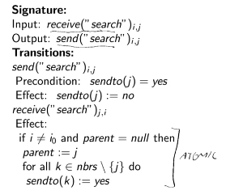

#### Reliable FIFO send/receive channels

`cause()` function maps an event to the preceding event that caused it.

- cause(receive(x)) = send(y) => x = y;
- For every send there is a mapped receive => Messages are not lost;
- For every receive, there is a distinct send => Messages are not duplicated;
- receive < receive' => cause(receive) < cause(receive') => Order is preserved.

**Channel automaton** - consumes `send("search")` and produces
`receive("search")` in reliable FIFO order.

- Assume no faults, and reliable FIFO send/receive channels;

---

- Doesn't necessarily produce a breadth first spanning tree;
- Faster longer paths will win over slower direct path when setting up parent;
- However, a spanning tree is constructed.
- **Invariant:** In any reachable state, the edges defined by all parent
  variables form a spanning tree containing $i_0$, moreover, if there is a
  message in any channel $C_{i, j}$, then $i$ is in this spanning tree.
  - Tudo se forma a partir de $i_0$ e só há mensagens em nós já integrados na
    árvore.
- **Invariant:** All nodes are searched.
- **Theorem:** algoritmo constroi a spanning tree no undirected graph G.

#### Properties

- Apesar de não existir time limits, vamos assumir umas upper bounds:
  - tempo para processar um effect => l;
  - tempo para entregar uma mensagem => d.
- **Complexidade:**
  - Nº mensagens é $O(|E|)$;
  - Tempo é $O(diam * (l + d))$ => `[l] -d-> [l] -d-> ...`
- Uma árvore com height, h, maior que diam pode occorer apenas se não demorar
  mais tempo que uma árvore com h = diam => não excede os bounds que assumimos.

#### Applications

- **Child pointers e broadcast** - se nos reportarem _parent_ e _nonparent_,
  conseguimos fazer broadcast;
  - A time complexity passa a ser $O(h * (l + d))$ ($O(n * (l + d))$ no pior
    caso). **Um caminho longo só se forma se for mais rápido, mas eventualmente
    pode deixar de ser mais rápido que o caminho curto => temos de
    reverificar**.
- **Broadcast with Acks** - coleta Acks enquanto a árvore vai sendo construida.
  Quando recebe um broadcast, nó dá Ack se já conhecer e dá Ack ao parent quando
  todos os neighbors que derem Ack;
- **Leader Election** - Se quando se iniciar termination, todos os nós
  reportared o seu UID, podemos fazer leader election com unkown diameter e
  número de nós.

### Epidemic Broadcast Trees

- **Gossip broadcast**:
  - highly scalable and resilient;
  - excessive message overhead.
- **Tree-based broadcast**:
  - small message complexity;
  - fragile in the presence of failures.
- **gossip strategies**:
  - eager push - immediately forward new messages;
  - pull - nodes periodically query for new messages;
  - lazy push - nodes push new message ids and accept pulls.

#### Gossiping into tree

- Nós escolhem conjunto pequeno (3 ou 4) de nós aleatórios como vizinhos;
- Links são bidirecionais (tentar que sejam estáveis);
- O canal em que recebemos uma mensagem primeiro fica **eager push**;
- Canais em que mensagem chega repetida ficam a **lazy push**;
- **Eager push** de payload e **lazy push** de metadata;
- Quando árvore parte, vamos receber metadata sem payload. Timer de controlo
  expira e promove **lazyPush** a **eagerPush**. Se ficarem caminhos redundantes
  => algoritmo limpa.

#### Small Worlds

- "Six degrees of separation";
- Watts Strogatz graph => low diameter e high clusting;
- Se dermos flood a um grafo destes, um observador global consegue encontrar
  caminhos $O(log N)$ entre 2 pontos arbitrarios;
- Os caminhos não têm locallity => é dificil encontrar esses caminhos curtos só
  com local knowledge.
- **Solução: Kleinberg** - em vez de usar uma probabilidade uniforme, dar mais
  prioridade a ligações próximas (exponencial) => **tipo os fingers no Chord**;

## System design for large scale

### Napster

- Centralized catalog of music descriptions and references to online users that
  hosted copies of it;
- Download are done among peers => sometimes I am the provider, other times I am
  the recepient;
- Due to presence of firewalls, ability to communicate with a server does not
  imply capacity to accept connection (**double firewall problem**);
- Relience on a server => tech weakness for legal attacks.

### Gnutella

- Fully distributed solution for P2P file sharing;
- Partially randomized overlay network. Cada nó conecta-se a k vizinhos;
- O número de vizinhos varia entre nós;
- **Bootstrapping** - HTTP hosted host cache + local host cache de sessões
  prévias;
- **High churn** => local host caches ficavam desatualizadas rapidamente;
- **Routing** => flooding + reverse path routing;
- **PING** + **PONG** - ping era flooded e então eu ficava a conhecer vizinhos a
  2, 3, 4, etc... hops;
- **QUERY** + **QUERY RESPONSES** - para fazer queries. Também é flooded e back
  propagated. O answer set aumenta com o tempo e o diameter ou os max hops serem
  alcançados;
- **GET** + **PUSH** - push é usado para dar circunvent a uma single firewall
  (double firewall não tem solução).

#### Improvements

- **Super-peers** - máquinas que têm maior capacidade e estavam sempre online.
  Nós preferiam conectar a nós com maior uptime;
- Super peers estavam conectados entre si;
- Peers comuns estavam conectados a um ou mais super peer (**two-tier
  architecture**);
- Ping/Pongs só se propagavam na camada dos super peers => super peers protegem
  outros de tráfego;
- Agora super-peers usam **bloom filter** para saber o conteúdo dos seus peers
  => peers só são contactados se tiverem uma alta probabilidade de ter o
  conteúdo.

### DHT

#### Chord

- UID no range [0, $2^m - 1$] - SHA1 do IP e das keys;
- O nó que guarda uma key é o nó com ID >= que a key (nodeId >= keyId);
- Tem de ser possivel contactar um nó arbitrario e pedir para encontrar o
  sucessor de um key;
- Cada nó tem m fingers (clockwise) e conhece r vicinity nodes (both
  directions);
- Routing é $O(log n)$.

#### Kademlia

- ID = SHA1 do IP => 160 bits;
- Distância de IDs é XOR. Esta métrica é simétrica e respeita a triangle
  property;
  - dist(10001, 11100) = 01101.
- Routing é simétrico. Alternative next hops can be chosen for low latency or
  parallel routing;
- Routing tables consist of a list for each bit of node ID em, que temos 1 bit
  em comum, depois 2, depois 3, etc... Quanto mais deep na tabela, fica
  exponencialmente mais dificil encontrar matching nodes. E.g. com ID =
  100110...

| Bits | Addr    |
| ---- | ------- |
| 0    | 0...    |
| 1    | 11...   |
| 2    | 101...  |
| 3    | 1000... |


- Para termos em conta falhas de nós, guardamos até k nós em cada posição
  (usualmente k);
- O uptime do nó é usado para desempatar limited positions.

## Physical and Logical Time

- **Clock drift** - drift between measured time and reference time for the same
  measurement unit;
- **External sync** - precision em relação a uma referencia authoritative. Para
  uma banda $D > 0$ e UTC source _S_, temos $|S(t) - C_i(t)| < D$;
- **Internal sync** - precision entre 2 nós. Para uma banda $D > 0$, temos
  $|C_j(t) - C_i(t)| < D$;
- Se 2 pessoas estao a 1D de uma source, podem estar até 2D entre si;
- **Monotonicity** - $t' > t => C(t') > C(t)$ - Many uses assume it => time
  can't go backwards. Correcting advanced clocks can be obtained by reducing
  time rate until aimed synchrony is reached;

### Synchronization

#### Synchronous system

- Sabendo o tempo de trânsito de uma mensagem que contém o tempo, podemos dar
  set a $t' = t + trans$;
- _trans_ pode variar entre _tmin_ e _tmax_. Usar um ou outro dá uma incerteza
  de $u = tmax - tmin$;
- Usando $t + \frac{tmin + tmax}{2}$, a incerteza torna-se $\frac{u}{2}$;

#### Asynchronous system - Cristian's algorithm

- **Problema:** tmax pode ser infinito;
- Faz um request, _mr_, que despoleta uma resposta _mt_ que contem o tempo _t_;
- Medimos o round-trip-time do request-reply => _tr_;
- Assumímos RTT balanceado (igual para cada lado) => $t + \frac{t_r}{2}$;
- Podemos aumentar a precisão repetindo o protocolo até ocorrer um _tr_ baixo;
- **Berkeley algorithm** - Um coordenador mede RTT para vários outros nós e dá
  set ao target time com a average dos tempos. O tempo que dá-mos set são
  deltas, e.g. avança 1 sec (em vez de mete x).

#### Causality - Happens-before

- Dá mais info que timeline (tempo é limitado);
- Só indica potencial influência;
- Tem a ver com memoria de eventos relevantes;
- Causal histories são encodings simples de causalidade (sistemas abaixo são
  mecanismos de encoding).

##### Causal histories

- Memorias são sets de eventos únicos;
- **Causality check** - inclusão num set explica causalidade:
  - iff {a1, b1} C {a1, a2, b1}
  - **Otimização:** testar apenas se o elemento mais recente da esquerda
    pertence.
- Tu estás no meu past se eu conheço a tua história;
- Se não conhecemos as nossas historias mutuamente => somos concurrents;
- Se as nossas historias são iguais => somos os mesmos;


- **Nota:** {en} C Cx => {e1...en} C Cx. Isto pode ser comprimido:
  - {a1, a2, b1, b2, b3, c1, c2, c3};
  - {a -> 2, b -> 3, c -> 3};
  - Se tivermos um nº fixo de processos totalmente ordenados => [2, 3, 3]. A
    união de sets torna-se num point-wise max (máximo em cada casa) (não
    esquecer que depois de unir é preciso incrementar evento on ocorreu).


#### Vector clocks

- Comprar gráficamente os vectors das causal histories;
- Se eu conheço uma coisa que tu não **e** vice-versa => concurrentes;
- Se eu conheço uma coisa que tu não => sou maior que tu;


- **Dots** - Em vez de ter [2, 0, 0], temos [1, 0, 0]a2;
- Assim temos o last event à parte => basta checkar esse para saber se ta num
  history;
- [1, 0, 0]a2 -> [2, 1, 0]b2 iff dot (a2) <= 2.

- **Relevant events** - Só eventos que são relevantes são adicionados ao
  histórico;

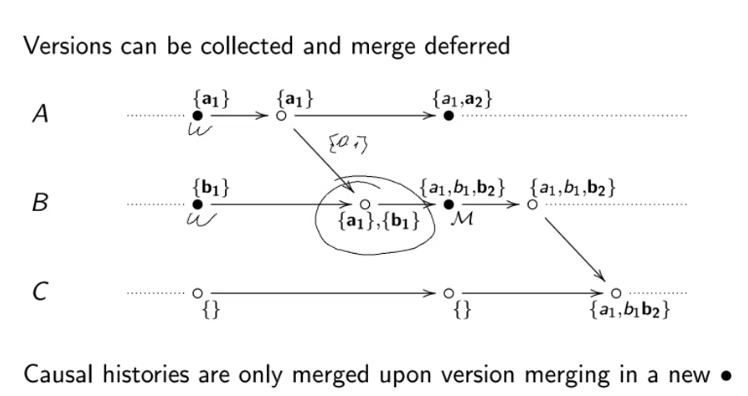

#### Version vectors

- **Version vector** != **Vector clock**;


#### Scaling causality

- Scaling at the edges (**DVVs**):
  - 8 máquinas no data center a gerir escritas;
  - 200 máquinas proxy com o cliente;
  - evitar 200 máquinas a criar updates no controlo de versão.
- Dynamic concurrency degree (**ITCs**):
  - creation and retirement of active entities;
  - passar de 8 máquinas para 10 (ou reduzir sem manter lixo).
- **Dynamo like**, get/put interface:
  - **Conditional writes** - rejeitamos escritas em sitios que têm conflito;
  - **Overwrite first value** (last writter wins) - rescrevemos último valor;
  - **Multi-Value** - mantemos escritas concurrentes (vetor de versão).

##### Dotted version vectors (DVV)

- Os eventos ficam ambos no server, separadamente: {s1}, {s2} => histórias
  diferentes => concurrentes;
- Para representar compactamente, pomos caixinha no meio do ar;


- `get()` vai retornar os 2 juntos => user tem depois de dar override na
  escrita;

##### Dynamic Causality (ITC)

- Tracking de causality requer acesso exclusivo a identidades;
- Ids podem ser dividos por parte de qualquer identidade (divisão infinita);
- Começamos com um ID original que se divide;


- Entities can register new events e tornar-se concurrentes;

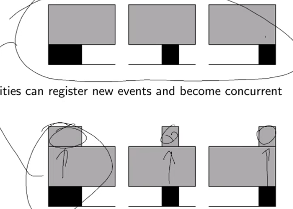

- IDs na imagem são todos superiores aos de cima mas concurrentes entre si;
- IDs podem dar join (**mesmo que não sejam partes de um todo originalmente**);

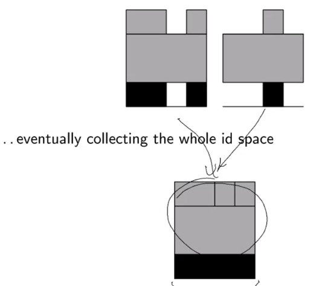

- Podemos juntar os IDs num só;
- **Important** cada replica ativa tem de controlar um espaço de IDs distinto;

## High Availability under Eventual Consistency

- **local** - l = 50ms
- **inter-continental** - L = [100ms, 300ms]
- **Planet-wide geo-replication**:
  - Consensus/Paxos => [L, 2L] (sem divergência);
  - Primary-Backup => [l, L] (asynchronous/lazy);
  - Multi-Master => l (allowing divergence).
- É impossível ter sempre linearizability (CAP theorem);
- **Eventually consistent** - Para sistema ser reliable é preciso trade-offs
  entre consistência e disponibilidade. Caso especial de **weak consistency**.
  Quando há update, se não houver mais updates eventualmente todos os read vão
  ver esse update.

### Session guarantees

- Read Your Writes;
- Monotonic Reads - reads sucessivos vêm as mesmas ou cada vez mais escritas;
- Write Follow Reads - escritas são propagadas depois dos reads em que dependem.
  Writes numa sessão só podem ser feitos após writes cujo efeito foi visto por
  reads passados na sessão;
- Monotonic Writes - Escrita só em incorporada numa copia do servidor se a cópia
  já tiver incorporado as escritas anteriores da sessão.

### Conflict-Free Replicated Data Types (CRDTs)

- Convergir depois de updates concurrentes => favorece availability e
  partition-tolerance (CAP);
- E.g. counters, sets, mv-registers, maps, graphs;
- **operation-based**:
  - todas as operações são comutativas (inc/dec);
- **state-based**:
  - Estados em conseguimos definir a operação de `join`;
  - `join` é indepotente;
  - `join` é associativo;
  - `<=` reflete monotonia na evolução do estado;
  - Updates têm de respeitar `<=`.
  - **Eventual Consistency, non stop** - `upds(a) C= upds(b) => a <= b`

### Principle of permutation equivalence

Se as operações numa execução sequencial podem comutar (preservando um
resultado), as mesmas numa execução concurrente podem comutar (preservando **o
mesmo** resultado).


- E.g. para um contador, guardamos pares (Incremento, Decremento);
- Join faz point-wise max nas entries;
- Valor do counter é soma de todos os Incs - soma de todos os Decs.

```
B(10, 0) --> {A(35, 0), B(10, 0)} -|
         |                         v
         --> {B(10, 0), C(0, 5)} ----> {A(35, 0), B(12, 0), C(0, 5)}
```

### Registers

- É um ordered set de write operations;
- **Simple approach**: Last Writer Wins. Usamos timestamps para discartar older
  writes.
  - **Problema:** se um peer tiver o relógio atrasado em relação a outro vai ser
sempre rejeitado.
  - O `apply()` é comparar timestamps e manter aquele que tem a maior;
  - O `join()` é escolher o que tem o maior timestamp.
- Um register mostra valor _v_ na replica _i_ se:
  - `wr(v)` for uma das operações que ocorreu em _i_ (_Oi_);
  - Não existir nenhum _v'_ em _Oi_, tal que `wr(v) < wr(v')`.
- **Preservation of sequential semantics** - Semanticas concurrentes devem
  preservar as semanticas sequenciais. Isto também assegura execução sequencial
  correta em sistemas distribuidos;

#### Multi-value Registers

- Não existe wr(v'), tal que $wr(v) \in O_i$ e wr(v) <(ordem parcial) wr(v');

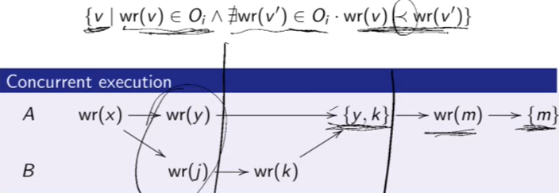

- Podemos implementar com **version vectors**;


### Sets

- **Synch:** Temos todos os _e_ que foram `add` e não têm `remove` à frente;
- **Asynch:** Usamos **Add-Wins**.
  - Temos todos os _e_ que foram `add` e não têm `remove` à frente (ordem
    parcial);
  - É o mesmo para ordem parcial.

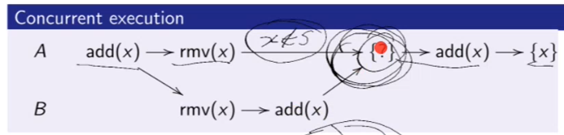

- No exemplo, ficamos com o _x_, porque existe um `add(x)` sem `remove(x)` à
  frente (no ramo do B).

- set é um par (payload, tombstones);
- `apply(add)` - cria tag de add;
- `apply(rmv)` - cria uma tag nas tombstones por cada add do elemento;
- `eval` - todos os adds que nao estão nas tombstones;
- `merge` - par (união de payloads, união de tombstones);

- Concurrent executions can have **richer outcomes**.
  - Com as operações abaixo, acabamos com {x, y};
  - Não é possível fazer uma execução sequencial que resulte nisso: fica sempre
    um `rmv` em último.

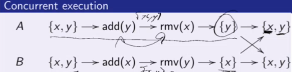

## Quorum Consensus

- Client comunica com server/replicas diretamente;
- Todos as réplicas são iguais entre si;
- Cada operação (read/write) requer um **quorum**;
- Se uma operação depende de outra, **quorums** têm de ter servers em comum;

### Read/Write quorums must overlap

- Replicas só fazem `read` e `write` => aplicadas a objetos num todo;
- Como output de `read` depende de `write` prévio, o read quorum tem de dar
  overlap ao write quorum:
  - $N_R + N_W > N$
  - Tamanho de read quorum + write quorum tem de ser maior que o número de
    replicas.

### Implementation

- Cada objeto tem um **version number**;
- **Read**:
  - Poll a read quorum para encontrar o current version number:
    - servers respondem com a versão atual;
    - pode haver um com uma verão maior.
  - Ler o objeto de uma replica atualizada (version number maior);
- **Write**:
  - Poll a write quorum para descobrir versão atual;
  - Escreve novo valor com nova versão num write quorum (assumimos que
    alternamos o objeto completo);
- **`write` depende de `write` prévio** (através de versões). Write quorums têm
  de dar overlap $N_W + N_W > N$ => isto previne incoerência.

#### Naive implementation with faults

- Se hover partição na rede durante write, replica que foi atualizada pode ser
  isolada da rede;
- Version bump não é propagado a tempo para o quorum todo;
- Alguém faz write num novo quorum de escrita (dá overlap com o antigo) mas o
  version bump vai ser o mesmo (antigo não foi visto);
- Partição da rede resolve-se => 2 objetos diferentes com a mesma versão;
- **Solução:** transações.

#### Naive implementation with concurrent writes

- Fomos buscar a versão ao mesmo tempo (2 clientes) => temos as mesmas versões;
- Ao dar o bump, ficamos com a mesma version;
- Os writes vão possivelmente dar 2 objetos diferentes em réplicas diferentes,
  mas com a mesma versão;
- **Solução:** transações.

### Ensuring Consistency with Transactions

- Usar um algoritmo de atomic commitment, e.g. **two phase commit**;
- O acesso é mesmo, mas é feito no contexto de uma transação;
- Cliente age como coordenador e as réplicas no quorum agem como participantes;
- Quando **faults**:
  - Na partição, só a réplica que ficou de fora respondia com commit;
  - As replicas que não viram update => não respondem ou respondem abort;
  - Client cancela transação;
  - O outro client dá commit na boa.
- Quando **concurrent writes**:

  - Quando se inicia o write, obtem-se um **lock**;
  - Aquele que chega primeiro fico com um lock para a sua transação => outra
    transação tem de esperar;
  - Após o primeiro two-phase commit (assumir sucesso), o segundo dá unlock;
  - Ao tentar escrever, pelo menos 1 das réplicas (sobreposição de write
    quorums) vai ver que está a invalidar um número de versão e aborta =>
    abortando assim a transação toda.

- **Problemas:**
  - **Deadlocks** são possíveis se transações usarem locks;
  - Se o coordenador falahar num tempo mau há blocking desnecessário;
  - Pode ser util user **coordinator proxy servers** em vez dos clientes
    coordenarem;
  - Transações trazem availability problems.

### Playing with Quorums

- Manipulando $N_R$ e $N_W$, podemos brincar com os trade-offs de performance e
  availability;
- **read-one/write-all protocol**:
  - estão todos no write quorum;
  - 1 deles também (sobreposição) está no read quorum (sozinho);
  - Leitura bué acessível e fast, mas write bué pesado => basta 1 server estar
    inacessível que já não conseguimos um write quorum. O write em todos, faz
    com que tenhamos de ligar a todas as réplicas.
- Quando baixamos $N_R$ temos de subir $N_W$ => trade-off => não dá para melhor
  leitura e escrita simultaneamente.

### Quorum consensus fault tolerance

- Tolera unavailability de réplicas:
  - inclui unavailability causada pelo processo ou pelo meio de comunicação
    (incluindo partições);
  - quorum não destingue entre os 2 tipos de falhas.
- No mínimo, só precisamos de (metade + 1) (N/2 + 1) das réplicas a funcionar,
  sendo que uma delas tem de fazer parte do quorum de escrita anterior. E.g.:
  - 12 réplicas;
  - 12/2 + 1 = 7;
  - 7 + 6 = 12 => 7 de escrita + 6 leitura em que algumas réplica estão nos 2
    quorums.

### Dynamo quorums

- Usa quorums para aumentar a disponibilidade;
- Não usa transações;
- Usa **version vector** em vez de número de versão;
- Cada key está associada a um set de server => **preference list**. Os
  primeiros N nas lista são as main réplicas e os outros são backup réplicas
  (para certos cenários de falhas);
- Cada operação tem um coordenador => uma das main réplicas da lista. Este
  desempenha as funções do cliente no quorum;

#### put(key, value, context)

- **context** - set de version vectors;
- Gera novo número de versão (determinada pelo context) e escreve valor
  localmente;
- Envia (key, value) e seu version vector para as main réplicas (da preference
  list) => success se pelo menos W-1 replicas responderem

#### get(key)

- Coordenador pede todas as versões do par (key, value) e seus version vectors
  das main réplicas restantes da preference list;
- Após receber pelo menos R-1 respostas, retorna todas aquelas que tenham o
  **version vector** maximal:
  - Se forem retornadas múltiplas versões, a aplicação que fez `get` é
    responsável por fazer `put` da reconsiliação da informação.

---

- Se não acontecerem falhas => dynamo dá **strong consistency**.
- Quando há falhas pode não ser possível obter um quorum => **sloppy quorum**:
  - Usamos os backup servers: tenham metadata que identifica quem é suposto ter
    a cópia certa (**votos para quem tem a info boa**);
  - Em writes, podem ficar a segurar dados enquanto esperam que as réplicas que
    estão a substituir voltem a vida => entregam-lhes os objetos quando elas
    voltarem;
  - **Problema:** não assegura consistency pk o write quorum pode não dar
    overlap com o anterior.

## Quorum-Consensus Replicated (Abstract Data Types) ADT

- Abstrair abstract data types em quorums;
- Quando executamos uma operação:
  - read from **initial quorum**;
  - write to **final quorum**.
- `read` operation => inicial é quorum de leitura e final é vazio;
- **quorum** de uma operação é um set de réplicas que inclui um initial e um
  final quorum;
- Assumindo que todas as réplicas são consideradas iguais, um **quorum** de uma
  operação é um par `(m, n)` cujos elementos são os tamos do quorum inicial (m)
  e final (n).

```plain
 ->write -----------> read
|   |
 ---
```

Quorum intersection graph.

- Todas as operações (read/write) passam a ter um initial (ler) e final
  (escrever) quorum.

### Constraints

- Quorum final da operação de escrita tem de intersetar cada quorum inicial da
  operação de leitura => **leitura vê sempre o meis recente**;
- Quorum final da operação de `write` tem de intersetar cada quorum inicial de
  `write` => **versions são updated corretamente**.
- E.g. minimal (size) quorum for an object with 5 replicas:

| Operation | quorum choices | ...    | ...    |
| --------- | -------------- | ------ | ------ |
| read      | (1, 0)         | (2, 0) | (3, 0) |
| write     | (1, 5)         | (2, 4) | (3, 3) |

### Replicated queue

- **Enq** - add item to queue;
- **Deq** - remove elemento mais recente da queue (exception se empty):
  1. Ler um initial quorum de read para obter versão da queue;
  2. Ler state numa updated replica;
  3. Se a fila n tiver vazia => **normal deq**. Abnormal deq acontece otherwise:
  - Remover item da head da queue;
  - Write novo queue state para o final **write quorum**;
  - Returnar item removido.
- Minimal quorum:
  - É só juntar a tabela anterior;
  - Enq (1 read e 1 write) - (1,5); (2,4); (3,3);
  - Normal Deq (1 read e 1 write) - (1,5); (2,4); (3,3);
  - Abnormal Deq (1 read) - (1,0); (2,0); (3,0);
  - Só a última hipótese é que faz sentido pk só precisa de 3 réplicas.

## Heligh's Replication Method

- Usa timestamps em vez de version number;
- Em vez de manter versões do estado, replicas mantêm logs => mais flexível;
- **Assumption:** Clients conseguem gerar timestamps que podem ser totally
  ordered:
  - order consistent with linearizability (omniscient observer);
  - hierarchical timestamp: 1 field para ordenar transactions e outro para
    ordenar dentro de uma transaction.

### Read

Similar ao version-based mas comparamos timestamps instead;

### Write

- Não há necessidade de ler versão de um initial quorum => não é necessária a
  initial message round;
- Cliente só precisa de escrever o novo estado para o final quorum (**suitable
  only for whole state changes**).

```
write -----> read
```

Quorum intersection graph.

- Minimal quorum choices (para 5 replicas):
  - Read - (1,0), (2,0), (3,0), (4,0), (5,0)
  - Write - (0,5), (0,4), (0,3), (0,2), (0,1)

### Event Logs

- **Event** - mudança de estado é um par (Operation, Outcome):
  - **Operation** - Read() ou Write(x);
  - **Outcome** - Ok() or Ok(x);
- **Log** - timestamped events.

### Implementation de uma replicated Queue

Exemplo de Deq;

- Pede logs a um initial quorum e cria uma view;
  - **view** é o merge dos logs por ordem das timestamps;
  - Discarta dups (same log).
- Reconstroi queue a partir da view e encontra item para returnar;
- Se a queue não estava vazia:
  - regista event => append à view;
  - envia a view modificada para um final quorum.

**Nota:** No Enq o cliente não envia a vista modificada no fim, só a operação.

#### Constraints


- Terceira coluna favorece abnormal deq que não muda state => não faz sentido;
- Balanced approach é cool.

#### Optimizations

Logs podem crescer indefinidamente.

- **Garbage coollection**:
  - Se um item foi deq, todos os items com earlier timestamp tmb tiveram de ser;
  - Podem ser readded com log merge;
  - **Horizon timestamp** - timestamp of the most recent deq;
  - Log vem só com timestamps maiores que **horizon timestamp**.
- **Cache logs at clients**.

### Issues

- Damos rely em timestamps gerados pelo client:
  - hierarchical timestamps podem resolver;
  - precisam de transações.
- Logs têm de ser garbage collected:
  - garbage collection dependem da ADT a ser implementada;
  - queue's é OK mas em outros ADT pode ser mais difícil.

## Consensus with Byzantine Failures

- **Byzantine Generals Problem (BGP)**:
  - **Agreement** - todos os processos OK entregam a mesma mensagem;
  - **Validity** - se o broadcaster for OK, todos os OK entregam a mensagem do
    broadcaster.
- **General rule** - os processos byzontinos têm de ser menos de 1/3 dos
  processos => BGP não tem solução em sistemas com 3 (ou menos) processos (a não
  ser que messages sejam **signed**).


- U - set dos servers;
- Quorum system - $Q C= 2^U$ - Todo Q E $Q$ é um quorum;
- $B$ - subsets de U que não estão contidos um no outro. Alguns B E $B$ contêm
  todos os faulty servers.

## Quorum consensus with Byzantine failures

- Cada operação precisa de um quorum;
- Se o resultado de uma operação depende do resultado de outra => quorums têm de
  dar overlap;

### Access Protocol: Asynchrony

- Get replies from all servers in a quorum. Byzonte can fail by not responding;
- At any time, there must be a quorum of non-faulty servers => might need to
  attempt operation multiple times on different quorus => eventually make
  progress.

### Access Protocol: Beginning and End Events

- **write**:
  - **begin** - when the client initiates the operation;
  - **end** - when all corrent servers in some quorum have processed the update.
- **read**:
  - **begin** - when the client initiates the operation;
  - **end** - when the `Result()` function return, thus determining the read
    result.
- _op1_ precedes _op2_ if _op1_ ends before _op2_;
- _op1_ and _op2_ are concurrent if neither precedes the other.

## Size-based Byzantine Masking Quorums

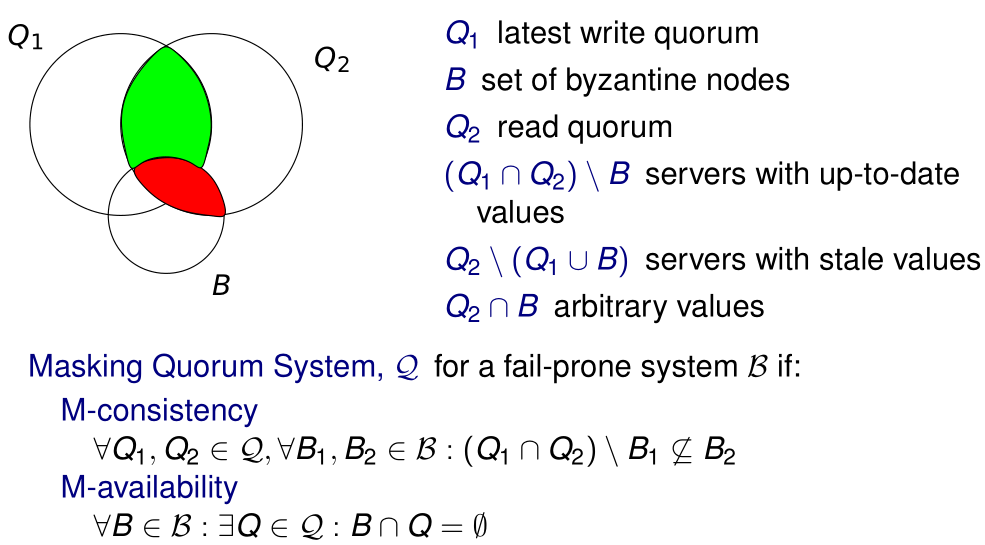

- **M-consistency** - ensures that a client always obtains an up-to-date-value
  => need to find it;
- Every pair of quorums must intersect in at least $2 * f + 1$ servers:
  - let f be the bound on faulty servers;
  - We need at least $f + 1$ up-to-date non-faulty servers => outnumber the
    faulty ones;

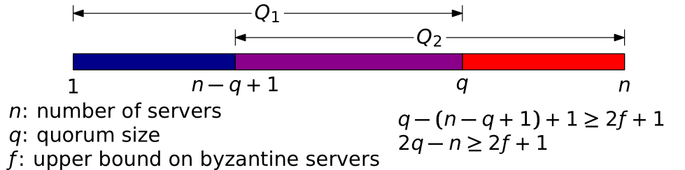

- **M-availability** - required for liveness;
- $n - f >= q$
  - f upper bound byzonte;
  - q size of a quorum;
  - n number of servers;

Combining the inequalities => $q = 3 * f + 1$

## Non-byzantine Read-Write Quorums based on size

- $w >= f + 1$ - ensures writes survive failures;
- $w + r > n$ - ensures that reads see most recent write;
- $n - f >= r$ - ensures read availability;
- $n - f >= w$ - ensures write availability.
- => $n > 2 * f$
  - Let $n = 2 * f + 1$;
  - All conditions are valid;
  - Apparently increasing _n_ only worsens performance, increases fault
    tolerance (f can rise).

### Read operation

- Query servers até ter reply de $3 * f + 1$ different servers;
  - _A_ é o set de value/timestamp pairs recebidos de pelo menos $f + 1$
    servers;
  - O _A_ é os pares que pelo menos $f + 1$ servers reportaram;
  - _A_ pode ser vazio se houver replicas que ainda n atualizaram valor.
- Fazer `Result(A)` => retorna o valor com maior timestamp (ou vazio se A for
  vazio).

### Naive Implementation under faults/concurrent writes

- Alguem tem de chegar à maioria primeiro => ganha;
- Se ninguem chegar a maioria, valor é considerada faulty nos reads e o Result
  não dá nada => escreve-se por cima depois.

## State machine replication

### Impossibility of consensus with faulty process

- **Consensus problem** - cada processo começa com um input value de um set _V_
  e têm de decidir num valor de _V_;
- **Safety:**
  - **Agreement** - todos os proc tomam a mesma decisão;
  - **Validity** - o valor está no set de valores possíveis.
- **Liveness** - todas as execuções do protocolo decidem num valor;
- **FLP's impossibility result:** num sistema asynch em que pelo menos 1 proc
  possa falhar, não há nenhum algoritmo determinista de consensus que seja
  **live** e **safe** (mesmo que a rede seja fiável).
  - Não dá para distinguir crash de slow;
  - Se proc não decide => ficamos stuck => viola liveness;
  - Se proc decide independentemente da decision rule => possivelmente viola
    safety.

### Views and Leaders

- **View** - configuração de sistema numerada:
  - replicas passam por uma sucessão de **views**;
  - cada **view** tem um **leader**: $p = v mod n$
  - v - view number; $n = 3 * f + 1$ - numero de replicas;
  - A **view** muda quando o leader atual é suspeito.

### Algoritmo (SMR)

- Client envia um pedido para executar uma operação ao **leader**;
- Leader **atomically bradcasts** the request para todas as replicas;
  - garante um ordem total na entreda de mensagens de non-faulty replicas;
- Replicas executam o pedido e enviam a resposta ao client;
- O client espera por respostas com o mesmo resultado que $f + 1$ replicas.

### Client

- O pedido do client (enviado ao leader) tem uma timestamp, t => garante
  **exactly once** semantics;
  - Monotonically increasing;
  - Todas as mensagens das replicas para o cliente incluém o current view
    number, v => client track o leader atual;
- O cliente espera por $f + 1$ replies com **assinaturas válidas** (com o mesmo
  t e r).
  - r - resultado;
- Se o cliente não obtiver respostas suficientes num intervalo de tempo:
  - Broadcast para todas as replicas;
  - Se pedido já foi processado, enviam resposta again;
  - Se não, replicas enviam o pedido para o **leader** => se este não fizer o
    multicast do pedido para o grupo, vai ser suspeito de ser faulty pelas
    replicas.

## PBFT - Quorums and Certificates

- PBFT uses quorums to implement atomic multicast;
- **Intersection** - any two quorums have at least a correct replica in common
  (they intersect in $f + 1$ replicas);
- **Availability** - there is always a quorum with no faulty replicas;
- Messages are sent to replicas;
- Replicas collect **quorum certificates**:
  - **Quorum certificate** - é um set com uma mensagem por cada elemento num
    quorum => assegura que a informação relevante foi guardada;
  - **Weak certificate** - set com pelo menos $f + 1$ mensagens de diferentes
    replicas => o set que um cliente tem de receber antes de returnar um
    resultado é um **weak certificate** (**Reply certificate**).

### Replicas

- Estado de uma replica:
  - Estado do serviço;
  - Message log - mensagens que a replica aceitam;
  - View id - current view id da replica.
- Quando leader, l, recebe um client request, m => começa three-phase protocol
  de multicast atomico (para todas as replicas):
  - **Pre-prepare**;
  - **Prepare** - garante total order dos requests numa view em conjunto com o
    **pre-prepare**;
  - **Commit** - garante total order de requests entre views.

### Pre-Prepare Phase

- Leader:
  - Dá um sequence number, _n_, ao request (monotonically increasing);
  - Multicast da mensagem de PRE-PREPARE para as outras replicas. Leva um digest
    da mensagem, _n_, e _v_.
- Replica aceita a PRE-PREPARE se:
  - estiver na view _v_;
  - As assinaturas no request m e na PRE-PREPARE message forem válidos (e d for
    digest de m);
  - Ainda não tiver aceite uma PRE-PREPARE para _v_ com _n_ e digest diferente;
  - _n_ tem de estar entre low e high watermark => previne faulty leader de
    esgotar o sequence number space selecionando um muito grande.

### Prepare Phase

- Ao receber PRE-PREPARE message, a replica entra em **prepare phase**:
  - multicast para as outras replicas de PREPARE.
- Ao receber PREPARE, a replica/leader aceita se:
  - A view for a mesma que a sua atual;
  - A assinatura estiver correta;
  - O sequence number tiver dentro das water marks.
- **Prepared Certificate** - cada replica coleta para o request _m_, em _v_, com
  _n_:
  - 1 PRE-PREPARE;
  - $2 * f$ PREPARES de outras replicas;
- Após certificado obtido, a replica sabe a ordem do request na view atual.

**Total order within a view** - com estas 2 phases, uma replica não pode obter
um certificado de requests diferentes com a mesma view e sequence number.

### Commit Phase

2 phases anteriores não garantem ordem entre view changes.

- Apos obter um prepared certificate:
  - Replica entrea commit phase;
  - Multicast de COMMIT para todas as replicas.
- Aceita COMMIT com os mesmos critérios que PREPARE;
  - Replica pode receber COMMIT antes de estar na commit-phase.
- **Commit certificate** - $2 * f + 1$ COMMIT messages (same _v_, _n_, _d_) de
  diferentes replicas;
- **Committed request** - se replica tiver **prepared e committed
  certificates**.

Guarante que se uma réplica se comprometer com um pedido, o pedido foi preparado
com pelo menos $f + 1$ non-faulty replicas.

### Request delivery and execution

- Executa pedidos committed quando executar todos aqueles com _n_ inferior =>
  non-faulty replicas execute requests in the same order.
- Replicas reply to the client after executing the reqeusted operation:
  - Discard requests com timestamp menor que a última timestamp que enviaram ao
    client => **exactly-once semantics**.

### Garbage collection + Checkpoints

- Não podemos apagar logs de pedidos já committed pk podemos usar em view
  changes;
- Replica repair/replace => need state synch;
- Replica periodicamente cria **checkpoint** do seu estado (prova de correção);
  - Depois de provado => **stable checkpoint**.
  - Prova requer troca de mensagens;
- Replica mantém várias cópias do seu estado:
  - última cópia estável;
  - 1 ou mais checkpoints ainda não estáveis;
  - estado atual.

### Checkpoint Proof Generation

- Replica faz multicast de CHECKPOINT message. Contém:
  - n - sequence number do last request executado no estado;
  - d - digest do state.
- CHECKPOINT messages recebidas são guardadas até **stable certificate** ser
  obtido;
- **stable certificate** - weak certificate ($f + 1$) de CHECKPOINT messages
  assinadas por diferentes replicas (**incluindo a si mesma**). isto para um _n_
  e _d_.
- Quando é coletado **stable certificate** a replica discarta:
  - PRE-PREPARE, PREPARE, COMMIT messages com _n_ menos;
  - Checkpoints mais antigos (e respetivas CHECKPOINT messages).
- Low e High watermarks são avançadas quando se começar um novo checkpoint.

## Blockchain - BitCoin

- Cadeia de blocos => set de eventos (também pode guardar estado);
- Cada bloco contém um **header** com metadata;
  - Inclui referência para o bloco anterior na chain;
- Primeiro bloco na chain é o **genesis block**;
- Blocos são appended à **blockchain head** (most recently added block);
- O tamanho máximo de um bloco é 1MByte.

### Network

- P2P em que cada nó se liga 8 nós;
- Usa um mecanismo de boostrapping;
- Não existe limite de nós então um nó (caso aceite conecções) pode ligar-se a
  muitos mais nós;
- Peers mantém uma cópia da blockchain inteira.

### Consensus

- É preciso concordar no conteúdo de blocos e sua ordem;
- Algorimos tradicionais que suportam falhas bizantines dão rely em quorums:
  - É dificil saber quantos nós existem na rede;
  - É facil criar múltiplas identidades (Sybil attack).
- **Solution:** **proof-of-work**.

#### Proof-of-Work (PoW)

- Resolver um puzzle cryptographico que leva um tempo aleatório (mas grande) a
  resolver;
  - Encontrar um **nonce** para por no header de um bloco de forma a que o seu
    SHA-256 seja menor que um **target** conhecido a priori.
- SHA-256 é non-invertible => temos de fazer brute force.
- O **target** é ajustado de modo a que seja gerado 1 bloco a cada 10 minutos:
  - Block rate é independente do hash-power da network;
  - São espectados $2^{256}/target$ hashes para resolver o puzzle;
  - Bitcoin ajusta o **target** a cada 2016 blocos (expectado equivaler a 14
    dias).

#### Block Broadcasting

- Após resolver PoW, nó dá broadcast do novo bloco;
- Após receber um bloco, um nó:
  - Verifica se é válido: verifica PoW e transactions;
  - Se bloco é valido, nó para de procurar PoW e adiciona o novo bloco à cabeça
    da blockchain;
  - Propaga novo bloco.
- Em ambos os casos, o nó começa a trabalhar no próximo PoW;
- Quando um nó recebe um bloco, podem faltar antecessores à chain:
  - Nó procura missing blocks.

#### Anti-Entropy

- Após validar novo bloco, nó envia aos seus vizinhos mensagens contendo um set
  de hashes de blocos que ele tem => inv message;
- Se nó recebe mensagem com hash de blocos que ele não tem, pede os blocos a
  quem enviou a mensagem => getdata message;
- Quando nó recebe `getdata`, envia os blocos pedidos => block message;
- Quando bloco é gerado, é inserido na rede usando um `block` message não
  solicitada.

#### Block propagation delay

- Validação de um bloco adiciona delay;
- Validação é repetida em cada hop;
- Block propagation delay has a **long tail distribution**.

#### Forks

- É possível que mais do que 1 peer possa resolver um PoW;
- O propagation delay grande o que pode contribuir para isto;
- Este evento chama-se **fork**;
- Se hourve conflitos, a blockchain mais comprida (com mais PoW) é que ganha;
  - Troca para a nova quando souber da sua existencia.
- Não há 100% garantia que um bloco vá persistir na chain:
  - Chance de ser removido diminui com cada bloco adicionado em cima;
  - 6 confirmations são consideradas final (chance);
  - **code-based checkpointing** - a hash de um bloco que não pode ser replaced
    (nem os que o precedem) foi hardcoded.
- **Eventual consistency** with high probability:
  - Assumindo que o hash power do adversario é limitado;
  - Se for maior que 50%, ele eventualmente pode mudar tudo.
- Selfish mining strategies podem não anunciar logo o seu PoW e começar a
  trabalhar numnovo até alguém anunciar o seu => começar a minar o seguinte mais
  cedo então têm maior chance de o substituir.

### Scalability

- Blockchain cresce 60GB por ano;
- Fazemos broadcast em rede muito grande;
- Só temos 1MB por cada 10 minutos;
- Só podemos fazer pouca transactions por segundo;
